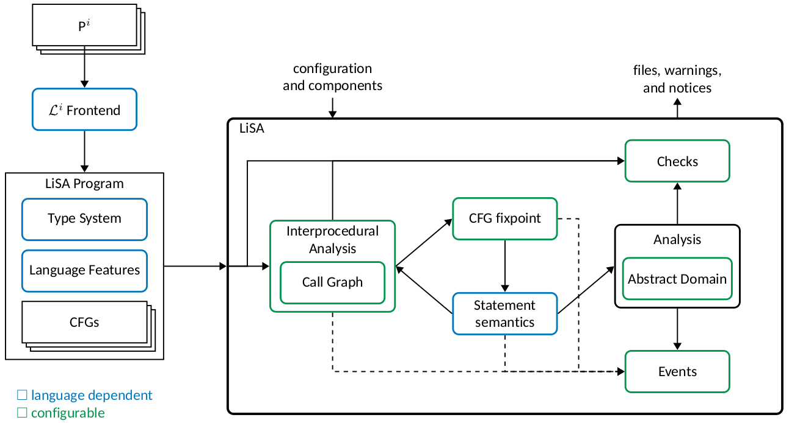

# LiSA's Structure

This section describes the internal structure of LiSA, providing an overview of
its main components and how they interact with each other.

The codebase of LiSA is split into four projects: `lisa-sdk`, `lisa-analyses`,
`lisa-program`, and `lisa-imp`. The `lisa-sdk` project contains the core
infrastructure of LiSA, including the analysis engine,
the control flow graph representation, and the framework for defining analyses
and checks. The `lisa-analyses` project implements a collection of ready-to-use
analyses that can be employed out of the box. The `lisa-program`
project provides simple `Statement` implementations that can be used for
quick prototyping of analyzers and for reference. Finally, the `lisa-imp` project
contains an implementation of the IMP language, which is used for testing and
demonstration purposes. The documentation in this section focuses primarily
on the `lisa-sdk` project, as it forms the foundation of LiSA's architecture.
Documentation on the IMP language can be found in the [IMP]({{ site.baseurl
}}/imp/) section, while a list of availble analyses is present under
[Configuration]({{ site.baseurl }}/configuration/).

A high-level overview of LiSA's structure is shown in the following diagram:

  

Intuitively, the analysis starts on a program P, written in a programming
language _i_, composed by a set of files. To keep things simple, we assume that
the program is written in a single language, but the process can be extended by
combining multiple frontends. The frontend for language _i_ parses the source
files of P and translates them into a LiSA's program, which is a
mainly composed by a set of control flow graph (`CFG`s). The CFGs are then passed
to LiSA, where the analysis starts.

The analysis begins by applying some validation checks on the program to ensure its
correctness. Then, the syntactic `Checks` are executed, which inspect the program's
structure without performing any semantic analysis. After that, the
`Interprocedural Analysis` is carried out, which computes a whole-program
fixpoint. Such a fixpoint is computed by analyzing each CFG in the program, delegating
to each `Statement` (the nodes of the CFG) the task of defining how it affects the
program state. Each statement can perform a combination of operations, since it
represent high-level constructs (e.g., calls, conditionals) rather than
low-level instructions (e.g., arithmetic operations, comparisons). Each
operation is either:

- a call to some other CFG, in which case the statement delegates back to the
  `Interprocedural Analysis` the computation of the result;
- an atomic operation whose effect depends on the abstract domain used for the
  analysis, in which case the statement forwards the operation (in the form of
  a `Symbolic Expression`) to the abstract domain currently in use.

Upon delegation to the `Interprocedural Analysis`, the latter computes the
result of the call by analyzing each possible target. Target resolution is
performed by the `Call Graph`, which computes of all possible call targets
by relying on both the program structure and the language-specific algorithms
for call resolution (part of the `Language Features`). This process enables
the simplification of abstract domains, as they do not need to handle
call resolution on their own.

When a global fixpoint is reached, the analysis ends. The results of the analysis
are then passed to the `Semantic Checks`, which inspect the analysis results
to detect potential issues in the program. Finally, the outputs of the analysis
are generated, which include warnings, graphs, and reports. During the whole
analysis, each component can emit `Events` to an event queue, where registered
listeners can process them, either synchronously or asynchronously, to produce
messages, logs, output files, or implement any custom behavior.

In the schematics above, components with blue borders are language-dependent,
meaning that they must be defined once for each programming language that
LiSA is used to analyze. Components with green borders are language-independent
and take part modularly in the analysis, allowing for easy extension and customization
of LiSA's capabilities.

A more in-depth explanation of each component can be found in the pages linked below,
together wiht pointers to the corresponding classes. For a step-by-step guide on
how to build each component, refer to the [Guides]({{ site.baseurl }}/tutorials/)
section.

## Analysis Components

Analysis components are the building blocks of LiSA's analysis engine. They define
how the analysis is performed, how the results are produced, and the general workflow
of the analysis. As highlighted by the diagram above, all components are
configurable: they are defined through interfaces and abstract classes, allowing
for easy extension and customization.

### Lattices

The `Lattice` interface defines the core operations that the information
produced by the analysis must support, following the Abstract Interpretation
theory. This interface is implemented by all information produced by domains,
fixpoints, and analysis results. Despite the name of the interface,
it does not enforce a lattice structure, but rather a poset with some extra
operations for retrieving abstractions of unknown values (`top` elements) and
unreachable or erroneous values (`bottom` elements). Other operations have
default implementations, but can be overridden to construct possibly complete
lattices. LiSA also comes with common lattice implementations ready to use.
Read more about lattices in the [Lattices]({{ site.baseurl }}/structure/lattices.md) page.

### Semantic Domains

The `SemanticDomain` interface defines the operations that an abstract domain
must implement to be used in LiSA's analyses. It is also implemented by the
non-extensible `Analysis` class, that is the outer-most domain that `Statement`s,
`Interprocedural Analysis`, and `Fixpoint`s interact with during the analysis.
Abstract domains are responsible for defining how the program state is manipulated
during the analysis. They provide operations for handling assignments,
expressions, and conditionals. Read more about semantic domains in the
[Semantic Domains]({{ site.baseurl }}/structure/semantic-domains.md) page.

#### The Simple Abstract Domain

In LiSA, an abstract domain is responsible for tracking the _whole_ program
state, including the values and types of variables and expressions, and the
structure of the memory. This can be a complex task, especially for languages
with rich features and constructs. To ease the development of new abstract
domains, LiSA provides the `SimpleAbstractDomain` class, which implements
a simplified model in which the program state is divided into three main components:

- the _memory domain_, which tracks the structure of the memory;
- the _type domain_, which tracks the types of variables and expressions;
- the _value domain_, which tracks the values of variables and expressions.

This separation allows domain developers to focus on specific aspects of the
program state, without worrying about the entire state management. Each
component can be implemented independently, and combined to form a complete
abstract domain. Read more about the simple abstract domain in the
[Simple Abstract Domain]({{ site.baseurl }}/structure/simple-abstract-domain.md) page.

### The Interprocedural Analysis

The `InterproceduralAnalysis` interface defines how the whole-program analysis is
performed. It is responsible for orchestrating the analysis of each `CFG` in the
program, and for computing the results of calls. These two tasks are tightly
coupled: if the analysis has to proceed top-down starting from a main function, then
calls are resolved by analyzing the target `CFG`s on-the-fly; if the analysis
proceeds bottom-up, then calls are resolved by retrieving pre-computed summaries
of the target `CFG`s. For this reason, a single entity is responsible for both tasks.
Individual `CFG`s are analyzed by delegating to a `Fixpoint` instance, which
computes the fixpoint for that specific `CFG`. Read more about the interprocedural
analysis in the [Interprocedural Analysis]({{ site.baseurl }}/structure/interprocedural-analysis.md) page.

#### The Call Graph

Solving calls is a fundamental task in interprocedural analyses, mainly relying
on the types of the call's parameters and on how the programming languages
matches call signatures to their targets. While the latter is fixed for a given
language (a detailed discussion is present later on this page, in the [Language
Features and Type System](#language-features-and-type-system) section), the former
can be carried out in different ways. To decouple call resolution from the
interprocedural analysis, LiSA introduces the `CallGraph` interface, which
defines how call targets are resolved. The call graph is queried by the
interprocedural analysis whenever a call is encountered, and it returns the
set of possible targets for that call. Read more about the call graph in the
[Call Graph]({{ site.baseurl }}/structure/call-graph.md) page.

### Syntactic and Semantic Checks

A `Check` is simply a visitor of the program, that provides hooks to inspect
various components of the program structure. There are two types of checks:

- `SyntacticCheck`s, which inspect the program structure without relying on
  any semantic information;
- `SemanticCheck`s, which inspect the results of the analysis to detect
  potential issues in the program.

Checks are executed at specific points during the analysis: syntactic checks
are executed right after the validation phase, while semantic checks are executed
after the interprocedural analysis has reached a fixpoint. Read more about checks
in the [Checks]({{ site.baseurl }}/structure/checks.md) page.

### Analysis Events

Several `Event`s are emitted during the analysis, to signal the occurrence of
specific situations. Events can be consumed by `EventListener`s, which can
process them either synchronously or asynchronously. This mechanism allows
for decoupling the analysis from side-tasks, such as logging, output generation,
or custom behaviors. Read more about events in the [Analysis Events]({{ site.baseurl }}/structure/events.md) page.

## Program Structure

### Units

### Control Flow Graphs

### Types

### Language Features and Type System

### Validation

### Statements and Expressions

### Symbolic Expressions

## Outputs

### Warnings and Notices

### Graphs

### Report

### Flamegraph

### Callgraph

## Frontends

### Parsing

### Phases

### Duties

### Libraries
