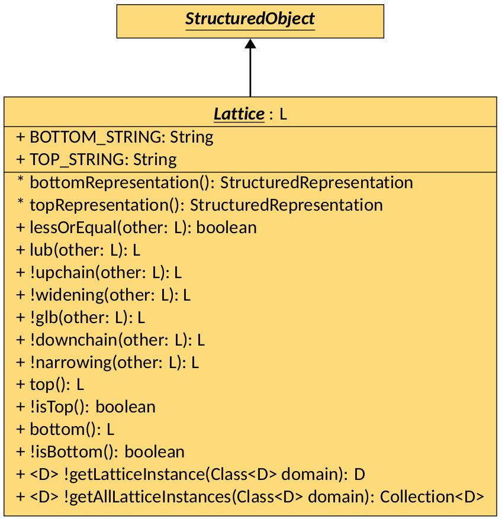
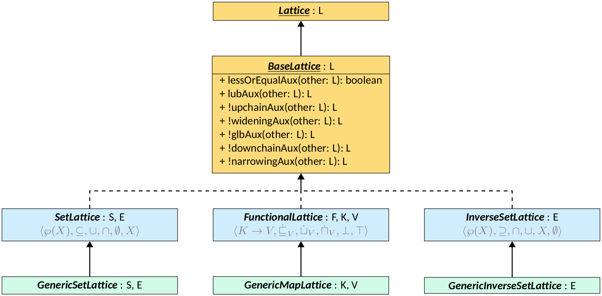
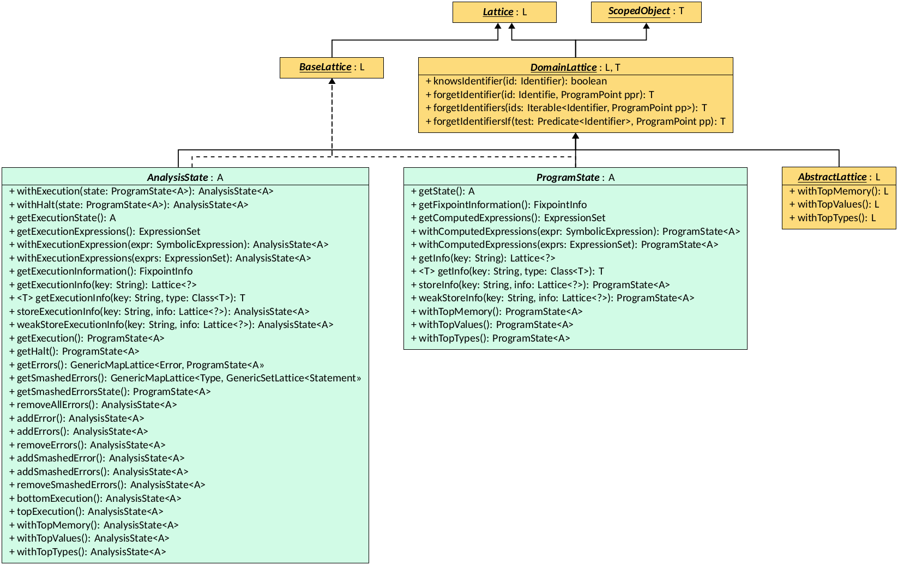

# Lattices



1. [Structured Representation and Structured Objects]({{ site.baseurl }}/structure/common-interfaces.html#the-structured-representation-interface) 
2. [Scoped Objects]({{ site.baseurl }}/structure/common-interfaces.html#the-scoped-object-interface) 
3. [Program Points]({{ site.baseurl }}/structure/common-interfaces.html#minimal-program-components)




Following the Abstract Interpretation theory, lattices are the central data
structure produced by the analysis. All values returned by domains,
fixpoints, and the
[Interprocedural Analysis]({{ site.baseurl }}/structure/interprocedural-analysis.html)
are instances of the `Lattice` interface. This page presents the `Lattice`
interface, its prerequisites, its main implementations and usages.

{% include note.html content="This page contains class diagrams. Interfaces are
represented with yellow rectangles, abstract classes with blue rectangles,
and concrete classes with green rectangles. After type names, type
parameters are reported, but their bounds are omitted for clarity.
Only public members are listed in each type: the `+` symbol marks instance
members, the `*` symbol marks static members, and a `!` in front of the name
denotes a member with a default implementation. Method-specific type
parameters are written before the method name, wrapped in `< >`." %}

## The Lattice Interface

The `Lattice` interface inherits from `StructuredObject` (see
[the interface definition]({{ site.baseurl }}/structure/common-interfaces.html#the-structured-representation-interface))
and represents an ordered structure.

  

The `Lattice` interface is designed such that each object of a type that
implements `Lattice` is an element of a partially ordered set that:

- can be compared with other elements using the partial order relation defined
  by the `lessOrEqual` method;
- can be combined with other elements using the `lub` (least upper bound)
  the `glb` (greatest lower bound), the `widening`, and the `narrowing` methods;
- can be used as singleton to retrieve the top and bottom elements of the lattice
  using the `top` and `bottom` methods.

Other methods are instead LiSA-specific:

- `upchain` and `downchain` are invoked by fixpoing algorithms instead of `lub`
  and `glb` when an existing lattice element representing the post-state of an
  instruction needs to be
  updated, e.g. in a successive loop iteration; for the vast majority of lattices,
  these methods simply coincide with `lub` and `glb`, respectively, but some lattices
  may implement different behaviors (for instance, reductions or closures may be
  applied only in chain traversals);
- `isTop` and `isBottom` are tests to assert if an arbitrary lattice element is
  the top or bottom element of the lattice;
- `getLatticeInstance` and `getAllLatticeInstances` are used to retrieve inner
  lattice elements from outer ones (e.g., all values of a functional lattice);
- `bottomRepresentation` and `topRepresentation` (static methods) generate
  `StructuredRepresentation`s of the bottom and top elements of the
  lattice, respectively, and exist, together with the `TOP_STRING` and the
  `BOTTOM_STRING` fields, to provide consistent ways to represent top
  and bottom values.

`Lattice` is parametric to the parameter `L` that must be a subtype of `Lattice<L>`. This
is a common pattern in Java to represent self-referential types, and it allows
to define methods that take or return instances of the same type as the
implementing class without the need of downcasting.
Note that, despite the name of the interface, implementations do not need to
be lattices: most methods have default implementations that reduce the
requirements:

- `widening` and `upchain` default to `lub`;
- `narrowing` and `downchain` default to `glb`;
- `glb` defaults to `bottom`;
- `isTop` and `isBottom` default to reference equality with `top` and `bottom`,
  respectively.

The minimum requirements are hence those of a complete partial ordered set, with the
addition of a `top` element for representing unknown values (e.g., user inputs
or non-deterministic values).



## Common Lattice Instances

When implementing lattices, some common patterns or structures occur frequently.
LiSA tries to reduce the effort required to implement these common cases by providing
some ready-to-use lattice implementations that can be extended or composed to
build more complex lattices:

  

### The BaseLattice Interface

The first provided implementation comes as the `BaseLattice` interface, that is
parametric to the parameter `L` (the lattice type, that must extend
`BaseLattice<L>`) and that extends `Lattice<L>`. `BaseLattice` provides default
implementations for most methods of the `Lattice` interface, each handling base
cases: in fact, regardless of the lattice structure, if one of the two elements
is either top or bottom, or if the two elements are equal, the result of any
operation is trivial. Therefore, `BaseLattice` implements these cases:

- `lessOrEqual` returns false if `other` is `null` or the bottom element, or if
  `this` is the top element; instead,it returns `true` if `this` and `other` are
  equals, if `this` is the bottom element, or if `other` is the top element;
- `lub`, `upchain`, and `widening` return `this` if `other` is `null` or the
  bottom element, or if `this` is the top element, or if `this` and `other` are
  equal; instead, they return `other` if `this` is the bottom element, or if
  `other` is the top element;
- `glb`, `downchain`, and `narrowing` return `this` if `other` is `null` or the
  top element, or if `this` is the bottom element, or if `this` and `other` are
  equal; instead, they return `other` if `this` is the top element, or if `other`
  is the bottom element.

In all cases where the return value is not determined by these base cases, `BaseLattice`
delegates the computation to the corresponding auxiliary method (i.e.,
`lessOrEqual` delegates to `lessOrEqualAux`, `lub` to `lubAux`, and so on), that
are the methods where the actual logic of the lattice is to be implemented. Most
auxiliary methods have default implementations that mimik the ones of `Lattice`:
`upchainAux` and `wideningAux` default to `lubAux`, `downchainAux` and `narrowingAux`
default to `glbAux`, and `glbAux` defaults to returning the bottom element.



### Powersets and Functions

The `BaseLattice` interface is implemented by three common lattice structures:

- `SetLattice`, implementing the classic powerset lattice
  structure (visible in the class diagram above);
- `InverseSetLattice`, implementing the dual of the powerset
  lattice structure (i.e., where the order of inclusion is inverted, also visible in
  the class diagram above);
- `FunctionalLattice`, implementing the functional lattice
  structure (i.e., where each element is a mapping from keys to lattice elements,
  also visible in the class diagram above).

`SetLattice` and `InverseSetLattice` are abstract classes with two type
parameters: `S`, the concrete type of the lattice (that must extend
`SetLattice<S, E>` or `InverseSetLattice<S, E>`, respectively), and `E`, the type
of the elements contained in the set. Both classes implement `BaseLattice<S>`,
meaning that all lattice operations will return/accept instances of S.
They implement the auxiliary methods
by performing the corresponding set operations (i.e., subset inclusion for
`lessOrEqualAux`, union/intersection for `lubAux` and `glbAux`, and so on),
with only `top` and `bottom` left to implement in subclasses. The actual sets
are tracked in the public field `elements`, of type `Set<E>`.

`FunctionalLattice` is an abstract class with three type parameters: `F`, the
concrete type of the lattice (that must extend `FunctionalLattice<F, K, V>`),
`K`, the type of the keys in the mapping, and `V`, the type of the values in the
mapping (that must extend `Lattice<V>`). `FunctionalLattice` implements
`BaseLattice<F>`, meaning that all lattice operations will return/accept
instances of `F`. It implements the auxiliary methods by applying functional
lifting to the lattice operations of the type `V` (i.e., pointwise comparison for
`lessOrEqualAux`, pointwise least upper bound/greatest lower bound for
`lubAux`/`glbAux`, and so on), with only `top` and `bottom` left to implement in
subclasses. The actual mapping is tracked in the public field `function`, of type
`Map<K, V>`. `FunctionalLattice` allows flexibility when accessing keys that are
not present in the mapping: by overriding the `stateOfUnknown` method, subclasses
can define what value of type `V` should be assumed for unknown keys.



To avoid creating subclasses for cases where no additional logic is required, LiSA
also provides two concrete implementations of the above classes, with `GenericSetLattice`,
`GenericInverseSetLattice`, and `GenericMapLattice`.

## Domain Lattices

A `DomainLattice` is a lattice that is designed to be used by a
[Semantic Domain]({{ site.baseurl }}/structure/semantic-domains.html) to track
information about program states. The main features of such lattices are that they
track information about program variables (called `Identifier`s in
[Symbolic Expressions]({{ site.baseurl }}/structure/symbolic-expressions.html)
terms) and that they can be _scoped_. Scoping is a mechanism provided by LiSA to
isolate parts of a lattice element when entering a new context (e.g., a function
call) and to restore them when exiting the context. Scoping is essential to
implement [Interprocedural Analyses]({{ site.baseurl }}/structure/interprocedural-analysis.html),
as it allows to track local variables without polluting the global state.

  

Scoping logic is provided by the `ScopedObject` interface (see
[the interface definition]({{ site.baseurl }}/structure/common-interfaces.html#the-scoped-object-interface))
For instance, a `pushScope`
implementation on a `FunctionalLattice` using `Identifer`s as keys would
produce a new `FunctionalLattice` where all `Identifier`s are renamed to
isolate the new scope, while keeping the values unchanged.

The `DomainLattice` interface is parametric to the type parameters
`L` (the concrete type of the lattice, that must extend `DomainLattice<L, T>`)
and `T` (the type of value returned by scope operations), and it extends `Lattice<L>`
and `ScopedObject<T>`. `DomainLattice` adds four methods that deal with
`Identifier`s:

- `knowsIdentifier`, that checks if the lattice contains information
  about the given identifier;
- `forgetIdentifier`, that returns a new lattice instance where all
  information about the given identifier is removed;
- `forgetIdentifiers`, that returns a new lattice instance where all
  information about the given set of identifiers is removed;
- `forgetIdentifiersIf`, that returns a new lattice instance where all
  information about identifiers matching the given predicate is removed.

### The Abstract Lattice

An `AbstractLattice` is a lattice that holds the information tracked by an
[Abstract Domain]({{ site.baseurl }}/structure/semantic-domains.html#the-abstractdomain-interface) about
program variables. This is the interface that allows configuration of the
analysis state: the concrete implementation of this interface is determined
by the analysis configuration, and it is wrapped into the `ProgramState` and
the `AnalysisState` for LiSA to use. An `AbstractLattice` is parametric to
the type parameter `L` (the concrete type of the lattice) and it extends
`DomainLattice<L, L>`. The interface defines three methods to manipulate the
state:

- `withTopMemory`, that returns a new lattice instance where all
  information about the memory structure of the program is removed;
- `withTopTypes`, that returns a new lattice instance where all
  information about the types of program variables and expression is removed;
- `withTopValues`, that returns a new lattice instance where all information
  about the values of program variables and expression is removed.

These serve as quick ways to forget parts of the analysis state when needed,
e.g., when analyzing function calls to external libraries.

### The Program State

The `ProgramState` is a snapshot of the the state of the program at a given
program point. It is mainly a wrapper around the configurable `AbstractLattice`
instance, that holds the actual information tracked by the analysis.
`ProgramState` is a class, parametric to the type parameter `A` that is the
concrete type of the `AbstractLattice` used by the analysis, that implements
`DomainLattice<ProgramState<A>, ProgramState<A>>` and
`BaseLattice<ProgramState<A>>`. This means that all lattice operators, scoping
operations, and identifier manipulations return instances of `ProgramState<A>`.

The class has three fields: the `state`, an instance of `A` that holds the
actual information tracked by the analysis; the `info`, an instance of
`FixpointInfo` (a `FunctionalLattice` from string keys to heterogeneous
`Lattice` instances) that holds optional auxiliary information produced
by the analysis, and the `computedExpressions`, a set of `SymbolicExpression`s
that represent the result of the last evaluation performed by the analysis.
The `info` field can be used to track program-specific information by
[Frontends]({{ site.baseurl }}/structure/frontends.html), such as the set
of already initialized classes in Java programs, or the set of aliases
introduced by Python's `import ... as ...` statements. Instead,
`computedExpressions` typically holds the last expression(s) evaluated by
the analysis that symbolically represent the contents of the operand stack.

`ProgramState` implements lattice operations by propagating the calls to
its inner components (that are lattices as well) and combining the results into
a new `ProgramState` instance. Scoping operations and identifier manipulations
are implemented by forwarding the calls to the inner `state` field.
Additionally, it provides accessors for its components, methods to change the
`computedExpressions` without modifying the rest of the state, and getters and
setters for the `info` field's mappings.

### The Analysis State

The `AnalysisState` is a wrapper around several `ProgramState` that correspond
to different states of the execution, and is the class that is used by LiSA to
track and manipulate the results of semantic computations.
The `AnalysisState` can be viewed as a
function from _continuations_ (in their compiler-theoretic meaning) to instances
of `ProgramState`. This allows the analysis to track multiple possible
execution paths at the same program point, e.g., when reaching an instruction
with a normal state or with an exceptional state. The supported continuations
are reflected in this class' fields:

- the normal execution, tracked in the `execution` field, that is updated
  normally when executing instructions;
- the halt continuation, tracked in the `halt` field, that is used to accumulate
  the states reaching execution-terminating instructions (e.g., Java's
  `System.exit()`);
- the error continuations, tracked in the `errors` field, that store states
  corresponnding to uncaught exceptions or runtime errors (e.g., division by zero).

The latter are stored in a map (i.e., a `GenericMapLattice`) from `Error`s (a
pair of an error [Type]({{ site.baseurl }}/structure/types.html) and a
[Statement]({{ site.baseurl }}/structure/st-ex-e.html) that raised the error) to
the corresponding `ProgramState`s. LiSA also offers the possibility to _smash_
uninteresting error continuations into a single one through the
[Configuration]({{ site.baseurl }}/configuration/). This is useful to reduce the
amount of tracked states when the analysis is not interested in specific
error types. When smashing is enabled, all smashed error continuations are
merged into a single `ProgramState`, stored in the `smashedErrorsState` field,
and the instruction that raised the smashed errors are tracked in the
`smashedErrors` field (a `GenericMapLattice` from `Type`s to sets of `Statement`s).

`AnalysisState` is a class, parametric to the type parameter `A` that is the
concrete type of the `AbstractLattice` used by the analysis, that implements
`DomainLattice<AnalysisState<A>, AnalysisState<A>>` and
`BaseLattice<AnalysisState<A>>`. This means that all lattice operators, scoping
operations, and identifier manipulations return instances of `AnalysisState<A>`.

Similarly to the `ProgramState`, `AnalysisState` implements lattice operations
by propagating the calls to
its inner components and combining the results into
a new `AnalysisState` instance.
Additionally, it provides accessors for its components, accessors for the
components of the execution state, proxies for the execution's `ProgramState`
methods (e.g., `getExecutionInfo` and `withTopMemory`) and methods to add or
remove new errors and smashed errors. `AnalysusState` is the lattice instance
managed and produced by LiSA's [Analysis]({{ site.baseurl }}/structure/semantic-domains.html#the-analysis-class).

Recall that `AnalysisState`, `ProgramState`, and `AbstractLattice` all represent
the state of the program at a given program point, and to not contain the logic
to update it when executing instructions. This logic is instead contained
in [Semantic Domains]({{ site.baseurl }}/structure/semantic-domains.html),
that manipulate these lattices to reflect the effect of instructions on
the program state.
