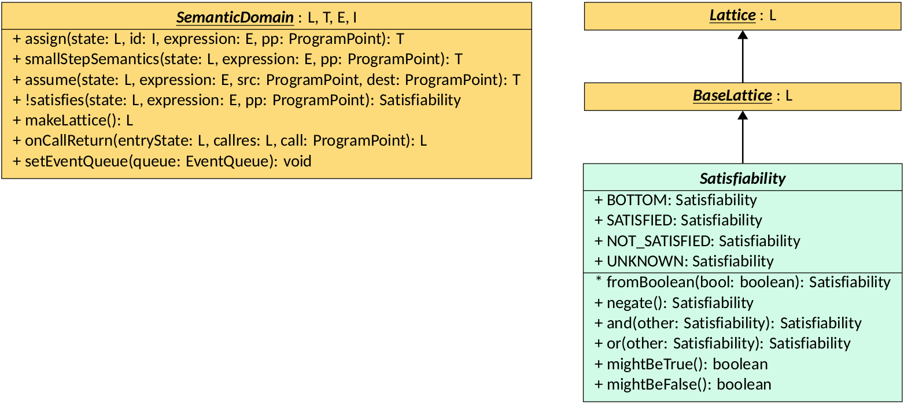
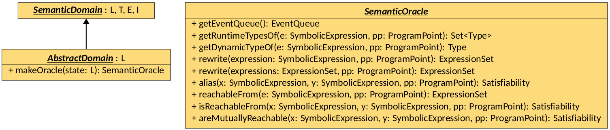
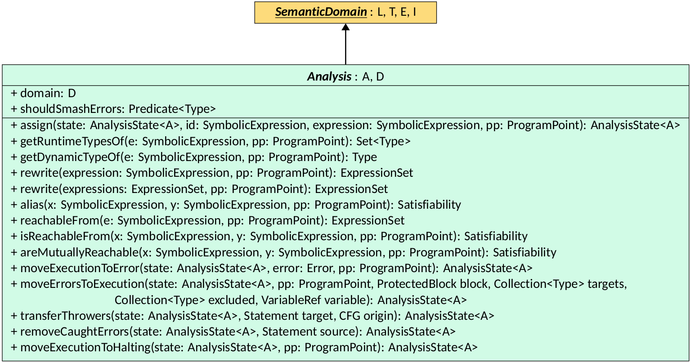

# Semantic Domains



1. [Program Points]({{ site.baseurl }}/structure/common-interfaces.html#minimal-program-components) 
2. [Lattices and Domain Lattices]({{ site.baseurl }}/structure/lattices.html)




Semantic domains implement transfer functions over lattice structures.
Contrarty to [Lattices]({{ site.baseurl }}/structure/lattices.html),
a unique instance of a semantic domain is used for the whole analysis.
Such instance is the one passed as part of the
[Configuration]({{ site.baseurl }}/configuration/), and is thus
user-defined.
This page presents the `SemanticDomain`
interface, its prerequisites, its main implementation and usages.

{% include note.html content="This page contains class diagrams. Interfaces are
represented with yellow rectangles, abstract classes with blue rectangles,
and concrete classes with green rectangles. After type names, type
parameters are reported, but their bounds are omitted for clarity.
Only public members are listed in each type: the `+` symbol marks instance
members, the `*` symbol marks static members, and a `!` in front of the name
denotes a member with a default implementation. Method-specific type
parameters are written before the method name, wrapped in `< >`." %}

## The SemanticDomain Interface

The `SemanticDomain` interface defines the available transfer functions that
anyone interacting with a domain implementation can perform over a state (i.e.,
a [`DomainLattice`]({{ site.baseurl }}/structure/lattices.html#domain-lattices)).
`SemanticDomain` has four type parameters:

- `L extends DomainLattice<L, T>` defines the type of abstract states the
  transformers accept as parameters (see the
  [Lattices]({{ site.baseurl }}/structure/lattices.html#the-domainlattice-interface) page;
- `T` defines the return type of the transformers (as, in some cases, a domain
  implementation might want to return a pair of a state and some auxiliary
  information);
- `E extends SymbolicExpression` defines the type of
  [SymbolicExpressions]({{ site.baseurl }}/structure/symbolic-expressions.html)
  the transformers can operate on;
- `I extends Identifier` defines the type of
  [Identifiers]({{ site.baseurl }}/structure/symbolic-expressions#identifiers)
  the transformers can assign values to.

  

There are three main transformers defined in the `SemanticDomain` interface:

- `assign`: assigns the value of a symbolic expression to an identifier in a
  given abstract state;
- `smallStepSemantics`: evaluates a non-assigning symbolic expression in the
  context of a given abstract state;
- `assume`: refines an abstract state given that a symbolic expression is known
  to evaluate to true.

The `assign` and `smallStepSemantics` methods are the core of any semantic domain,
and are called several times during the analysis of a program in different
places. For instance, [Statements]({{ site.baseurl }}/structure/st-ex-e.html)
use them to evaluate expressions and assignments, the
[Interprocedural Analysis]({{ site.baseurl }}/structure/interprocedural-analysis.html)
uses `assign` to
model parameter passing and return value assignments, and so on.
Instead, `assume` is mainly called when traversing conditional
[Edges]({{ site.baseurl }}/structure/st-ex-e.html#edges) in a
[CFG]({{ site.baseurl }}/structure/cfgs.html).

{% include warn.html content="`Identifier`s can be _strong_ or _weak_.
A strong identifier represent exactly one variable or memory location: when
assigning a value to it, it is safe to forget any previous value (similarly to
what an assignment to a variable does in any programming language). A weak
identifier may instead represent multiple variables or memory locations (i.e.,
it might be a summary of several memory locations): when assigning a value to it,
it is not safe to forget previous values, as they might still be relevant.
When semantic domains assign values to weak identifiers, they must `lub` the new
value and the previous one together, and store the result as the new value for that
identifier." %}



`SemanticDomain` further defines four methods:

- `satisfies`: checks whether a symbolic expression is satisfied or not
  by the information contained in the given state (mimicking the evaluation of a
  boolean expression);
- `makeLattice`: creates a new instance of the state (of type `L`) managed by
  the domain (the returned instance will be used as singleton to retrieve top and
  bottom elements, **as well as serving as a starting state for the analysis**);
- `onCallReturn`: invoked by the
  [Interprocedural Analysis]({{ site.baseurl }}/structure/interprocedural-analysis.html)
  when returning from a call to perform any necessary cleanup or state update;
- `setEventQueue`: called at the start of the analysis to provide the domain
  with a reference to the analysis
  [Event Queue]({{ site.baseurl }}/structure/events.html) (implementations of
  this method should invoke it on nested domains, and optionally store the queue
  in a field for later usage).

The `satisfies` method returns an instance of `Satisfiability`, a `Lattice` instance
that models sets of boolean values (i.e., true, false, both, or none).





## The AbstractDomain Interface

The `AbstractDomain` interface is a specialization of `SemanticDomain` that
defines what a user of LiSA has to provide to implement an analysis.
It is parametric on the type `L`, which extends `AbstractLattice<L>`, that is
the concrete type of [Abstract Lattices]({{ site.baseurl }}/structure/lattices.html#the-abstract-lattice)
managed by the domain. The interface extends `SemanticDomain<L, L, SymbolicExpression, Identifier>`,
meaning that the transformers return instances of the same type as the input state, and
that they operate on generic symbolic expressions and identifiers.

  

`AbstractDomain` adds one additional method to those already defined in
`SemanticDomain`: `makeOracle`. This method returns a `SemanticOracle`, that
roughly corresponds to a pair of the domain and a specific abstract state at a
given program point. The oracle can be used to query the domain about properties
that hold in that specific state:

- it can be used to retrieve the event queue through `getEventQueue`;
- it can be used to inspect the runtime types or the dynamic type (i.e., the
  `lub` of all possible runtime types) of expressions;
- it can be used to rewrite expressions into simpler forms, given the information
  available in the state;
- it can be used to query information about the memory structure of the program
  (e.g., aliasing or reachability).

Note that the oracle must be **sound**, but it is not required to be as precise
as possible: for instance, the oracle might return all possible types when asked
for the runtime types of an expression. Such information will be used
throughout the analysis, e.g. when resolving call targets or when computing the
semantics of a statement. The more precise the oracle is, the more precise the analysis
will be, but also the more expensive it will be to compute.

## The Analysis Class

The `Analysis` class is the central component that LiSA uses to evolve
[Analysis States]({{ site.baseurl }}/structure/lattices.html#the-analysis-state).
Since the `AbstractDomain` used for an analysis is user-provided, this allows
analysis-independent implementations of other compoments (like statement semantics
or interprocedural analyses): there is no compile-time binding between these entities
and the concrete instances of `AbstractDomain` that will be executed,
thus all operations that are performed by such entities have to be agnostic of the
actual domain in place. This ensures a high level of modularity: all internal
analysis components can be changed or replaced without requiring any modification
of external ones.

The `Analysis` class is parametric on the type `D`, that extends
`AbstractDomain<A>`, of the abstract domain to use during the analysis, and
on the type `A`, that extends `AbstractLattice<A>` of the
[Abstract Lattices]({{ site.baseurl }}/structure/lattices.html#the-abstract-lattice)
managed by `D`.
Similarly to `AbstractDomain`, the `Analysis` class implements
`SemanticDomain<AnalysisState<A>, AnalysisState<A>, SymbolicExpression, Identifier>`,
meaning that the transformers return instances of the same type as the input state
(that is, of the [Analysis State]({{ site.baseurl }}/structure/lattices.html#the-analysis-state)), and
that they operate on generic symbolic expressions and identifiers.

  

The `Analysis` class contains the `domain` to execute and the
`shouldSmashErrors` predicate as fields. The latter is a predicate passed to
LiSA as part of the [Configuration]({{ site.baseurl }}/configuration/) that
decides which error types are not interesting for the user, and can thus be
"smashed" inside the analysis state.
Transformers defined by `SemanticDomain` are implemented by invoking the
corresponding operation on the `domain`, using the normal execution continuation
as source. The expression that has been evaluated (or, in the case of
assignments, the `Identifier` that has been assigned) is stored in the
`ProgramState`'s computed expressions.

`Analysis` also provides several additional methods:

- a variant of `assign` that takes in an arbitrary `SymbolicExpression` as the
  left-hand side, that will be rewritten through `rewrite` as necessary to obtain
  an `Identifier`;
- convenience wrappers around `SemanticOracle` methods, that simply create the
  oracle
  through `domain.makeOracle` and invoke the corresponding method on it;
- methods to manage the alternating of the state between the normal execution
  and other continuations:
  - `moveExecutionToError` sets the normal execution to bottom, and moves the
    input normal execution to either an error continuation or the smashed errors
    continuation, depending on the result of `shouldSmashErrors`;
  - `moveErrorsToExecution` transfers the least upper bound of the error states
    that can be assigned to one of the `targets` types but to none of the
    `excluded` types to the normal execution, optionally assigning the error left
    on the stack to the provided `variable`, if any;
  - `transferThrowers` modifies the error continuations by changing the
    instruction that threw them if it was inside the `origin` CFG (this is useful
    for moving throwers from callee to caller, such that error catching constructs
    can correctly identify if they should handle them);
  - `removeCaughtErrors` removes from the error continuations all errors that
    are caught by incoming edges into the given `source`;
  - `moveExecutionToHalting` sets the normal execution to bottom, and moves the
    input normal execution to the halting continuation.
